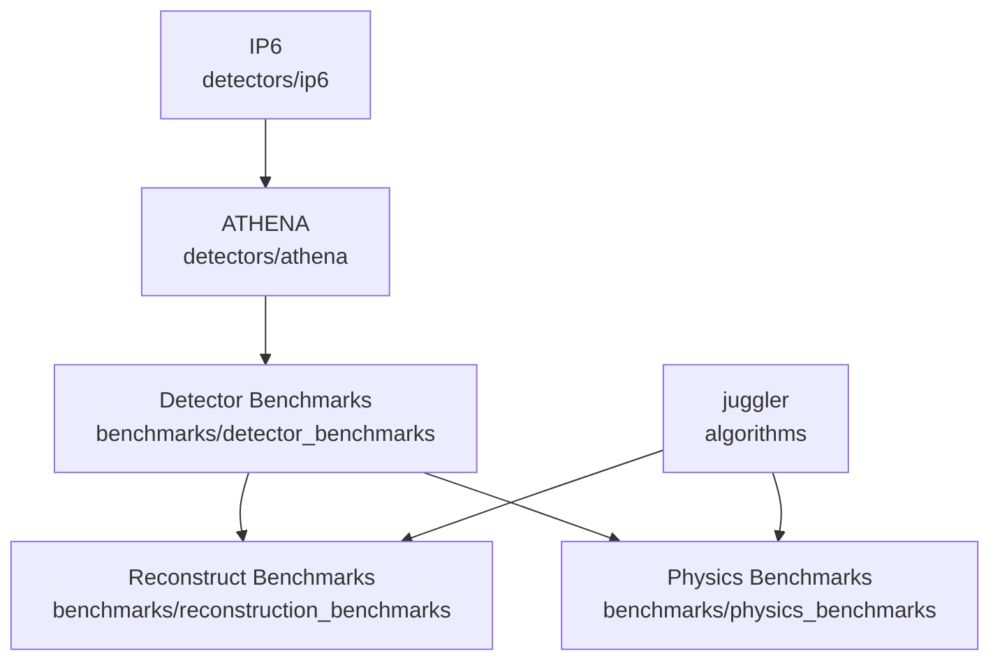

Physics Benchmarks for the EIC
==============================


## Documentation Links

- [`eicd`](https://eic.phy.anl.gov/eicd) - EIC Data Model. (See [`ReconstructedParticle`](https://eic.phy.anl.gov/eicd/classeic_1_1_reconstructed_particle.html) for most needs)
- [`juggler`](https://eic.phy.anl.gov/juggler) reconstruction framework.
- Benchmark repository common code - [common_bench](https://eicweb.phy.anl.gov/EIC/benchmarks/common_bench)
- [Guide to tracking](https://eicweb.phy.anl.gov/EIC/documentation/guide_to_tracking/-/blob/master/README.md)
- ROOT's [`RDataFrame`](https://root.cern/doc/master/classROOT_1_1RDataFrame.html)

## Adding new benchmarks

See the [`benchmarks/DVCS`](https://eicweb.phy.anl.gov/EIC/benchmarks/physics_benchmarks/-/tree/master/benchmarks/dvcs)
directory for a basic example. Note currently the reconstruction is far from perfect.

### Pass/Fail tests

- Create a script that returns exit status 0 for success.
- Any non-zero value will be considered failure.
- Script  

See [common_bench](https://eicweb.phy.anl.gov/EIC/benchmarks/common_bench) for details.

## Running Locally

### Local development example

Here we setup to use our local build of the `juggler` library.
First set some environment variables.
```
export JUGGLER_INSTALL_PREFIX=/usr/local 
export JUGGLER_DETECTOR=athena   # athena is the default
export BEAMLINE_CONFIG=ip6       # ip6 is the default
```

```
git clone https://eicweb.phy.anl.gov/EIC/benchmarks/physics_benchmarks.git && cd physics_benchmarks
git clone https://eicweb.phy.anl.gov/EIC/benchmarks/common_bench.git setup
source setup/bin/env.sh && ./setup/bin/install_common.sh
source .local/bin/env.sh && build_detector.sh
mkdir_local_data_link sim_output
mkdir -p results config

```

## Repositories and Workflow

### Repositories

The collaboration uses [the EIC group on eicweb](https://eicweb.phy.anl.gov/EIC) which contains the subgroups
[detectors](https://eicweb.phy.anl.gov/EIC/detectors) and
[benchmarks](https://eicweb.phy.anl.gov/EIC/benchmarks). 

The main software components locally developed are:
- [`juggler`](https://eicweb.phy.anl.gov/EIC/juggler) ([documentation](https://eic.phy.anl.gov/juggler)) - Event processing framework (i.e. algorithms live)
- [`eicd`](https://eicweb.phy.anl.gov/EIC/eicd) ([documentation](https://eic.phy.anl.gov/eicd)) - EIC data model
- [`npdet`](https://eicweb.phy.anl.gov/EIC/npdet) - collection of dd4hep simulation plugins and tools.

The key collaboration/user code repositories are:

- [detectors/ip6](https://eicweb.phy.anl.gov/EIC/detectors/ip6) - IP6 specifics (forward and backward beamline and detectors).
- [detectors/athena](https://eicweb.phy.anl.gov/EIC/detectors/athena) - ATHENA detector
- [Detector benchmarks](https://eicweb.phy.anl.gov/EIC/benchmarks/detector_benchmarks) - Set of analysis scripts  run on the Geant4 output before any digitization or reconstruction. Also contains some detector calibrations.
- [Reconstruction benchmarks](https://eicweb.phy.anl.gov/EIC/benchmarks/reconstruction_benchmarks) - Analysis of the many aspects of reconstruction. This is where the tracking performance benchmarks and plots live. Also a good place for developing new algorithms.
- [Physics benchmarks](https://eicweb.phy.anl.gov/EIC/benchmarks/physics_benchmarks) - Analysis of reconstructed for physics performance.  The goal is to provide metrics for optimizing detector design and reconstruction. 


### Pipelines and Artifacts

The SWG leverages gitlab's CI/CD features heavily in our workflow.
Here are some simplified explanations of these.

#### Pipeline 

A pipeline is an automated set of jobs/scripts that are triggered by certain actions, such as pushing a merge request or merging into the master/main branch of a repository.
Typically there is one pipeline per repository but there can multiple and a pipline can trigger downstream pipelines ("child" pipelines) or it can be triggered by an upstream pipeline. They can also be triggered manually.

The graph below show some of the downstream pipeline triggers (arrows) between different repositories.


Note that on any change to the detectors will cause all the benchmarks to be run.

"OK, pipelines run automatically. What is the big deal?"

#### Artifacts

All pipeline jobs have "artifacts" which are just selected files that are saved and can be downloaded individually or as a zip file.

Note artifacts are not the output data which is far too big. Artifacts are small files such as images, plots, text files, reports, etc.

Below is an image and link to a pdf of the latest ATHENA detector version generated by a job artifact from the `master` branch pipeline.
<br>
<a href="https://eicweb.phy.anl.gov/api/v4/projects/473/jobs/artifacts/master/raw/images/view01.pdf?job=report">

</a>
<br>
Artifacts can be browsed via the web interface, for example, the latest in reconstruction benchmark results in the 
[`final_report` job can be browsed](https://eicweb.phy.anl.gov/EIC/benchmarks/physics_benchmarks/-/jobs/artifacts/master/browse/results?job=final_report).
<br>
<a href="https://eicweb.phy.anl.gov/api/v4/projects/400/jobs/artifacts/master/raw/results/dvcs/Q2.png?job=dvcs:results">

</a>
<br>


